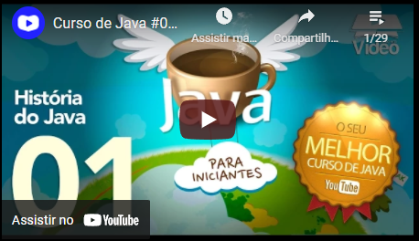

# Acesse a página em:
https://deboragoncalves1.github.io/pagecourses/

<!DOCTYPE html>
<html lang="pt-br">
<head>
    <meta charset="UTF-8">
    <meta http-equiv="X-UA-Compatible" content="IE=edge">
    <meta name="viewport" content="width=device-width, initial-scale=1.0">
    <title>Meus vídeos</title>
    <link rel="shortcut icon" href="midia/favicon.ico" type="image/x-icon">
</head>
<body bgcolor="black">

     
  
         
             
                 <h1 >Vídeos legais para assistir</h1>
                  
                 
                  
                 
                 
             
              
         <q>Os videos indicados na página são de autoria do professor Gustavo Guanabara, a divulgação visa desenvolver aula prática do curso HTML5+CSS   e divulgar o trabalho do professor com outros alunos. A utilização é realizada sem fins lucrativos com o unico intuito de aprendizado.</q>

            
<q>Página desenvolvida por: <I>Debora Gonçalves,  </I></q>

         </q>  
    

</body>
</html>
